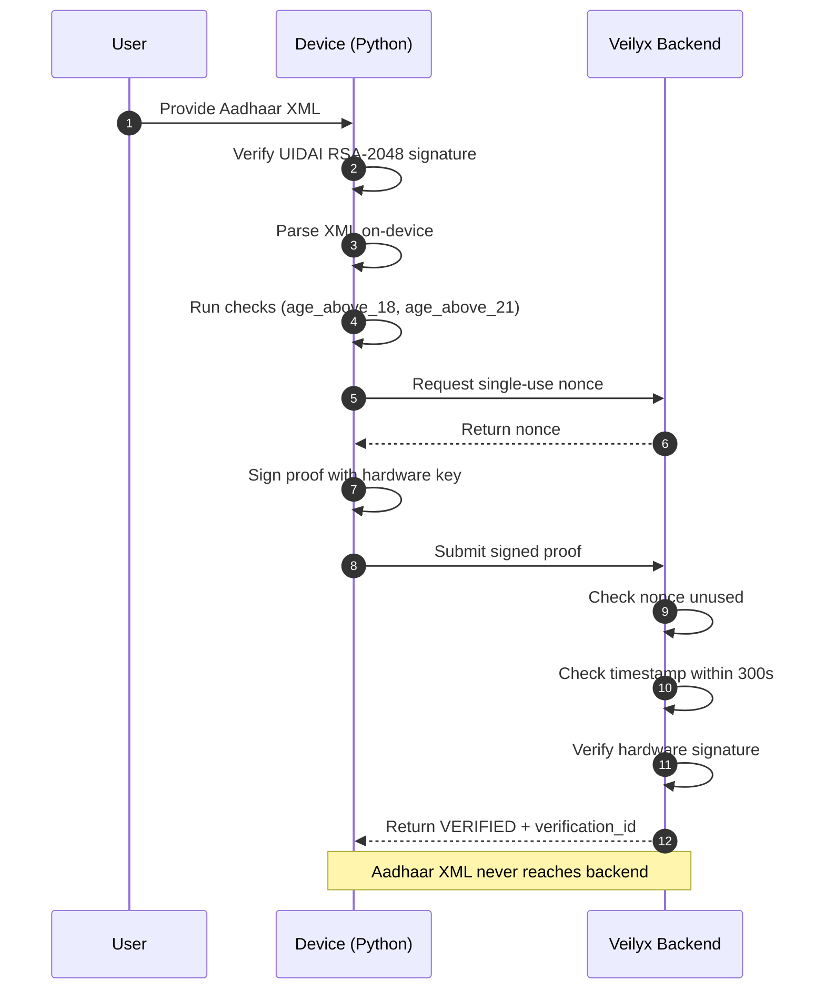

# Veilyx — Python CIA-3
### Identity Verification Demo · Christ University Delhi NCR
**Proofs, not documents**

A self-contained Python simulation of the Veilyx cryptographic identity verification system.


---

# Problem

Every Indian app that verifies user identity must collect and store Aadhaar documents.

This introduces:

- Large databases of sensitive personal data
- Breach liability under the DPDP Act 2023 — up to Rs 250 crore per incident
- Complex KYC compliance overhead
- Onboarding friction for users

---

# How It Works

Verification happens **entirely on the user's device**.

The backend receives only:

- A cryptographic proof
- A device identifier
- A signature

Example payload received by the backend:

```json
{
  "checks": {
    "age_above_18": true,
    "age_above_21": true,
    "calculated_age": 27
  },
  "status": "VERIFIED",
  "cost_inr": 10
}
```

No identity documents are transmitted or stored.

---

# Architecture Flow



---

# Run It

```bash
python veilyx_demo.py
```

To use your real Aadhaar XML:

1. Open DigiLocker app
2. Go to Issued Documents -> Aadhaar Card -> Download XML
3. Save the file as `aadhaar.xml` in the same folder
4. Run again

---

# Sample Output

```
=======================================================
  VEILYX - Identity Verification Demo
=======================================================
  Proofs, not documents. Zero storage.

Step 1: Load Aadhaar XML from DigiLocker
  [>>]  In production: user taps DigiLocker, XML downloaded in one tap
  [!!]  No aadhaar.xml found -- using mock XML

Step 2: Verify UIDAI Digital Signature (RSA-2048)
  [>>]  Tampered XML has invalid signature -- rejected before parsing
  [OK]  Mock signature accepted for demo

Step 3: Parse XML On-Device
  [>>]  No data leaves the device during this step
  [OK]  Name:    Rahul Sharma
  [OK]  DOB:     1998-08-15
  [OK]  Gender:  M
  [OK]  State:   Delhi

Step 4: Run Verification Checks
  [OK]  Age: 27 years
  [OK]  Age above 18: True
  [OK]  Age above 21: True

Step 5: Fetch Single-Use Nonce from Backend
  [>>]  Nonce prevents replay attacks -- each proof is one-time use
  [OK]  Nonce received: QGo5dQPQZ4DxDmyFXYRP...

Step 6: Build and Sign Proof in Hardware
  [>>]  Signing happens inside TEE / Secure Enclave
  [>>]  Private key never leaves the hardware chip
  [OK]  Signature: 4UEGkWkK2faBsjAeHwPH...
  [>>]  Aadhaar XML discarded after this step

Step 7: Submit Proof to Veilyx Backend
  [>>]  Backend verifies signature -- never sees Aadhaar XML

=======================================================
  RESULT: VERIFIED
  [OK]  Verification ID: fbbc9a5f05480bc3
  [OK]  Age above 18:    True
  [OK]  Age above 21:    True
  [OK]  Cost charged:    Rs 10
=======================================================

Bonus: Replay Attack Test
  [>>]  Submitting same proof again -- should be blocked
  [OK]  Replay blocked: Nonce already used -- replay attack blocked
```

---

# Security Architecture

| Control | Implementation | Status |
|---|---|---|
| UIDAI XML signature verification | RSA-2048 signature check before parsing | Active |
| Replay protection | Single-use nonces marked used immediately | Active |
| Timestamp freshness | 300 second proof expiry window | Active |
| Hardware-backed signing | MockHardwareKeystore (real: AndroidKeyStore / Secure Enclave) | Simulated |
| Timing-safe comparison | hmac.compare_digest instead of == | Active |
| Zero document storage | Proof-only model, no XML ever stored | Active |
| Cross-company injection | company_id validated against authenticated key | Active |

---

# Python Concepts Used

| Concept | Where Used |
|---|---|
| Classes and objects | `MockHardwareKeystore`, `MockVeilyxBackend` |
| `__init__` constructor | Key generation on device creation |
| Instance variables | `self.device_id`, `self.public_key`, `self.used_nonces` |
| Functions with type hints | All functions use `->` return type annotations |
| Default parameters | `def log(msg, color=RESET)` |
| Try-except error handling | XML parsing, date format parsing |
| For loops with continue | Trying multiple date formats |
| List, dict, set | `verification_logs`, proof payload, `used_nonces` |
| Tuple unpacking | `valid, reason = verify_uidai_signature(...)` |
| F-strings | All terminal output formatting |
| File handling | `with open(xml_path) as f: f.read()` |
| Standard library only | xml, hashlib, hmac, json, time, secrets, base64, os, datetime |
| `if __name__ == "__main__"` | Entry point guard |

---

# Project Structure

```
Python-CIA-3/
├── veilyx_demo.py        # Main demo -- run this
└── README.md             # This file
```

---

# The Real Product

This demo simulates the real Veilyx SDK in pure Python.

| This Demo | Real Veilyx |
|---|---|
| `MockHardwareKeystore` | AndroidKeyStore (TEE/StrongBox) + iOS Secure Enclave |
| `hmac.new()` signing | ECDSA with secp256r1 inside hardware chip |
| Mock UIDAI signature check | RSA-2048 verification against UIDAI certificate |
| In-memory nonce store | FastAPI + PostgreSQL on Railway |
| `secrets.token_urlsafe()` | Same -- already production-grade |

**Live backend:** `web-production-fe8772.up.railway.app`  
**Swagger UI:** `web-production-fe8772.up.railway.app/docs`  
**Full repo:** `github.com/shashwatkhandelwal-debug/veilyx`

---

# Team

| Name | Roll Number |
|---|---|
| Shashwat Khandelwal | 25211248 |
| Om Katiyar | 25211266 |
| Dev Avasthi | 25211269 |
| Aditya Yadav | 25211206 |
| Shashank Yadav | 25211261 |
| Ansh Arora | 25211213 |

**Subject:** Python for Data Analytics
**Class:** 2BBAFMA-A  
**Submitted to:** Mr. Sanjeev Sharama, Christ (Deemed to be University), Delhi NCR  
**Date:** 19th March 2026

---


